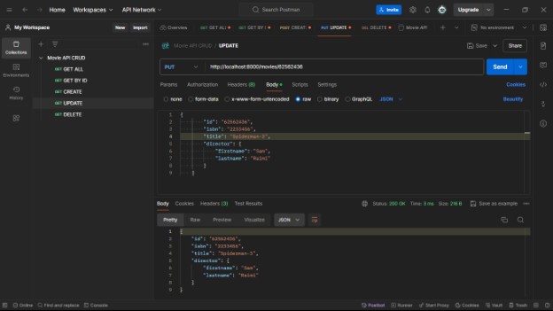

# Movie API

This project provides a simple API for managing movies. You can perform various operations like getting a list of movies, getting a movie by its ID, creating a new movie, updating a movie, and deleting a movie.

## Endpoints

### 1. Get All Movies

- **URL**: `/movies`
- **Method**: `GET`


### 2. Get Movie by Specific ID

- **URL**: `/movies/{id}`
- **Method**: `GET`


### 3. Create Movie

- **URL**: `/movie`
- **Method**: `POST`


### 4. Update Movie

- **URL**: `/movies/{id}`
- **Method**: `PUT`



### 5. Delete Movie

- **URL**: `/movies/{id}`
- **Method**: `DELETE`


## Running the Project

To run this project, follow these steps:

1. **Clone the repository**:
    ```sh
    git clone https://github.com/vibzz2003/MOVIE-API-CRUD-golang.git
    ```
2. **Navigate to the project directory**:
    ```sh
    cd MOVIE-API-CRUD-golang
    ```
3. **Run the server**:
    ```sh
    go run main.go
    ```

The server will start at `localhost:8080`.

## Endpoints Usage

Use the following endpoints to interact with the Movie API:

- **Get all movies**: Send a `GET` request to `/movies`.
- **Get a movie by ID**: Send a `GET` request to `/movies/{id}`.
- **Create a movie**: Send a `POST` request to `/movie` with the movie details in the request body.
- **Update a movie**: Send a `PUT` request to `/movies/{id}` with the updated movie details in the request body.
- **Delete a movie**: Send a `DELETE` request to `/movies/{id}`.
